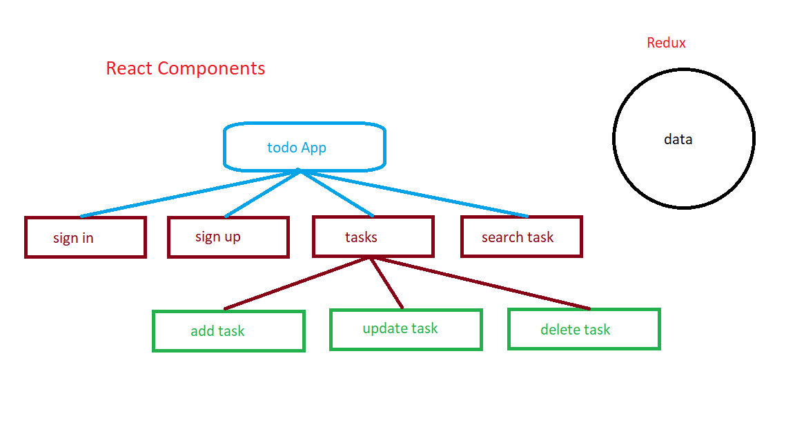

## Command used to create this project

### `yarn create react-app hello-redux`

## Available Scripts

In the project directory, you can run:

### `yarn start`

Runs the app in the development mode.

### `yarn test`

Launches the test runner in the interactive watch mode.

### `yarn build`

Builds the app for production to the `build` folder.

## command used to install redux

### `yarn add redux`

### `yarn add react-redux`

## Redux DevTool FireFox extension

### `https://addons.mozilla.org/en-US/firefox/addon/reduxdevtools/`

## gh-pages setup

- `yarn add gh-pages - save-dev`

- add homepage attribute in package.json like below
    - "homepage": "https://s-rajkumar.github.io/Hello-React-Redux"

- add below in package.json `scripts` attribute
    - "predeploy": "yarn build"
    - "deploy": "gh-pages -d build"

### `yarn deploy`

Builds project and commit build folder to gh-pages branch in remote repository

## Docs

### Structure Map

Redux eliminates data not to be inside the components. 

- Store
    - like DB [for Me]. 
    - Ref. src/index.js #11 - #14

- Reducers
    - you can write morethan one reducer
    - you can combine multiple reducers in single store
    - here our data manipulation based on inputs
    - it returns state/data we called.

- Actions
    - it defines what action to be perform.
    - this will define what reducer case to be execute
    - this return type of actino and payload that we need for data manipulation in reducer

- useSelector
    - useSelector used to get state/data values

- Dispatch
    - this used to trigger/call the actions

## Flow
 1 Store
    - here allready we defined actions and reducers
 2 Dispatch
    - call the action you want
 3 useSelector
    - get value of state/data

